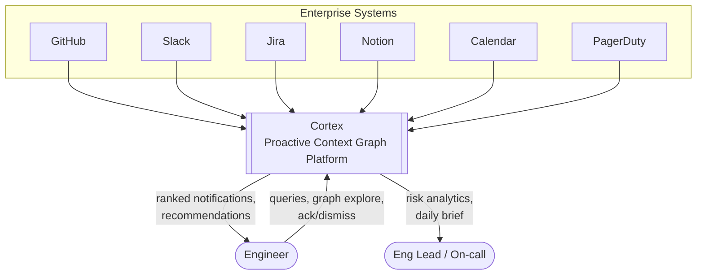
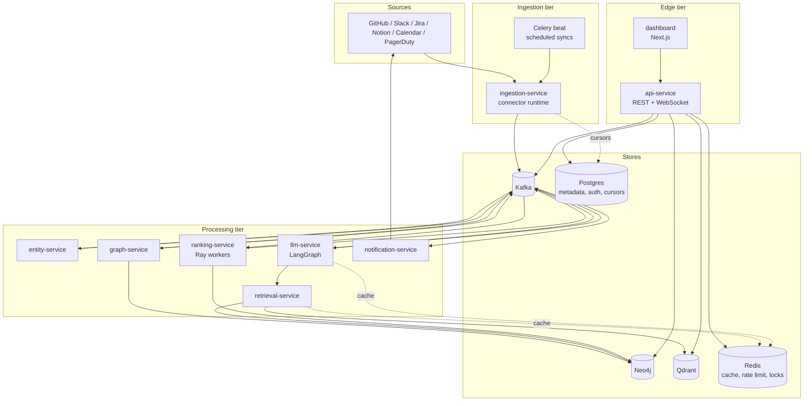
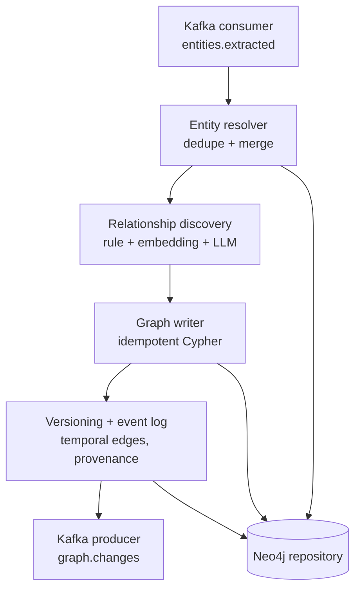
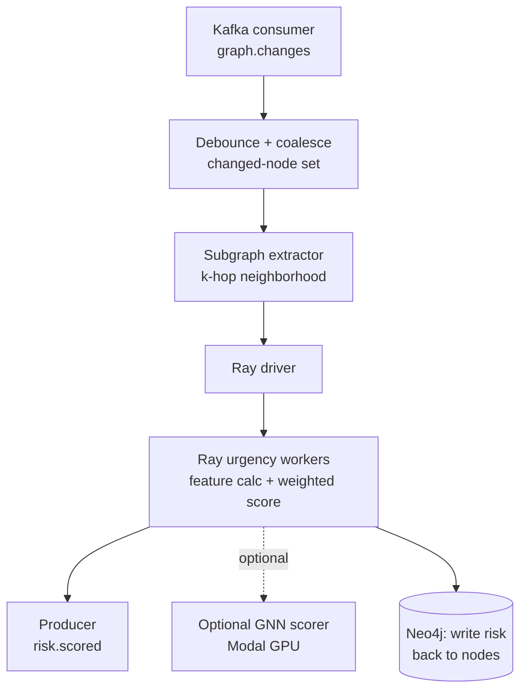
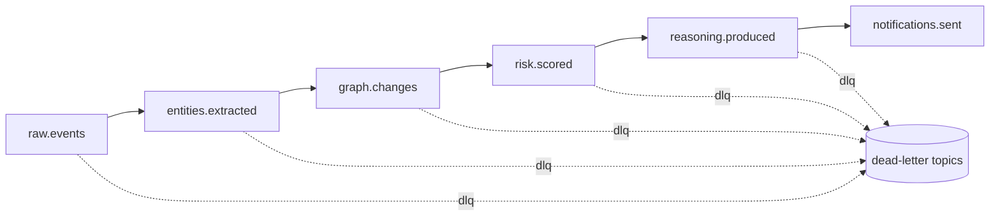
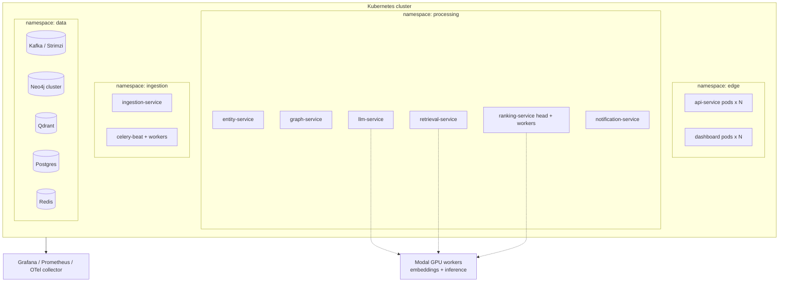

# Architecture

Cortex is an event-driven system of independently deployable services joined by a Kafka bus. Nothing calls the next stage synchronously across the pipeline; each service consumes a topic, does its work, and produces to the next topic. This decouples throughput (a slow LLM stage cannot stall ingestion), makes each stage independently scalable, and gives every mutation an audit trail.

This document uses the C4 model: system context, then containers, then a component view of the two most involved services. Diagrams are Mermaid.

---

## C4 Level 1 — System context

Cortex is read-mostly toward the source systems: connectors pull events and, where offered, subscribe to webhooks. It writes back only as notifications (a Slack message, an email, a webhook) — never mutating source data. That keeps the trust and permission surface small and avoids write-scope OAuth on every connector.

---

## C4 Level 2 — Containers

Store ownership is strict. Only `graph-service` writes Neo4j. Only `retrieval-service` writes Qdrant. `ingestion-service` owns sync cursors in Postgres. `api-service` reads across stores but mutates none of the pipeline stores directly — user actions (ack, dismiss, snooze) are published as events so the pipeline stays the single writer. This is the repository-per-store rule from [ADR-0004](../adr/0004-repository-pattern.md).

---

## C4 Level 3 — graph-service components

The graph service is where cross-source joins actually happen, so it carries the most internal structure.

The resolver decides whether an incoming entity is new or an alias of an existing node (same person across GitHub login / Slack ID / email; same service across repo name / deploy target). Relationship discovery runs three tiers in order of cost: deterministic rules first (a PR body containing `PAY-1193` → `PR REFERENCES Ticket`), then embedding similarity for fuzzy links, then an LLM pass only for the residue the first two cannot decide. The writer emits idempotent Cypher (`MERGE`, not `CREATE`) so replayed events converge instead of duplicating. Versioning stamps every edge with `valid_from`/`valid_to`, a confidence score, and the source event id (provenance). Details in [`docs/data/graph-model.md`](../data/graph-model.md).

---

## C4 Level 3 — ranking-service components

Ranking does not rebuild global scores on every event. `graph.changes` carries the ids of nodes touched by a write; the debounce stage coalesces bursts (a PR merge produces many edge writes in a second) into one changed-node set, extracts the k-hop neighborhood around those nodes, and scores only that subgraph. This keeps cost proportional to churn, not graph size — the key to holding sub-second freshness at 100k+ nodes. The scoring model itself is in [`docs/design/urgency-scoring.md`](../design/urgency-scoring.md).

---

## Event-driven flow and back-pressure

Kafka topics are partitioned by `org_id` so one tenant's burst cannot starve another and per-org ordering is preserved. Consumers are grouped so each service scales horizontally by adding partitions/consumers. Slow stages (LLM reasoning) do not block fast ones (ingestion) — work simply queues. Each consumer commits offsets only after a successful produce to the next topic, giving at-least-once delivery; idempotent writes downstream (MERGE in Neo4j, dedup keys in the notification store) make at-least-once safe. Poison messages route to a per-topic dead-letter topic after N retries with exponential backoff rather than blocking the partition.

The full topic catalog and the event envelope schema are in [`docs/design/api-and-events.md`](../design/api-and-events.md).

---

## Deployment topology

Local development runs the same services under Docker Compose with single-node Kafka/Neo4j/Qdrant and Ray in local mode; GPU stages fall back to CPU or a hosted embedding API. The progression from Compose to Kubernetes and the scaling knobs per tier are in [`docs/deployment.md`](../deployment.md).

---

## Cross-cutting concerns

Auth and org isolation are enforced at `api-service` (JWT, org-scoped) and again at the data layer (every Neo4j and Qdrant query is filtered by `org_id`; there is no unscoped query path). See [ADR-0008](../adr/0008-auth-and-tenancy.md). Observability is uniform: every service emits OTel spans that stitch a single trace from source event to delivered notification, Prometheus scrapes RED metrics (rate, errors, duration) per stage plus queue depth per topic, and logs are structured JSON with the trace id. Caching (Redis) sits in front of graph queries, embeddings, and LLM outputs keyed by content hash so replays and repeated questions are cheap. Each concern has an ADR.
