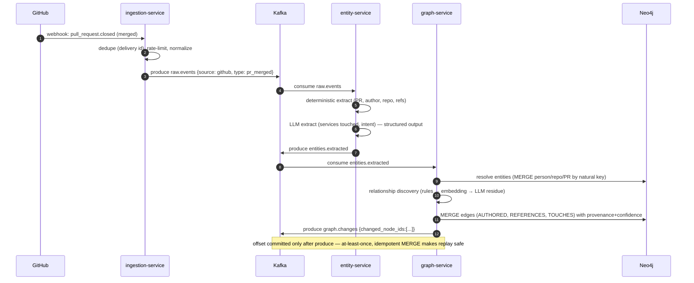
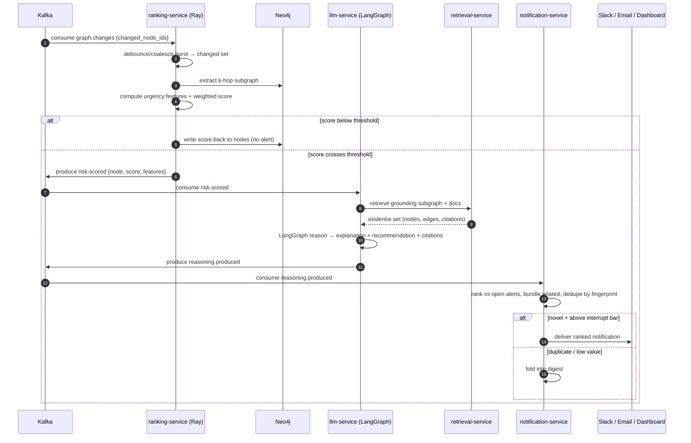
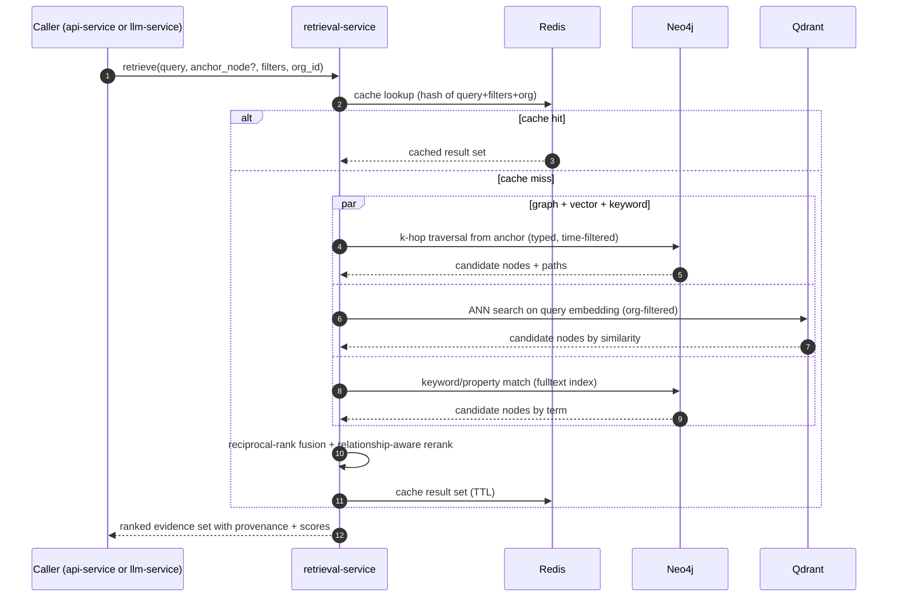
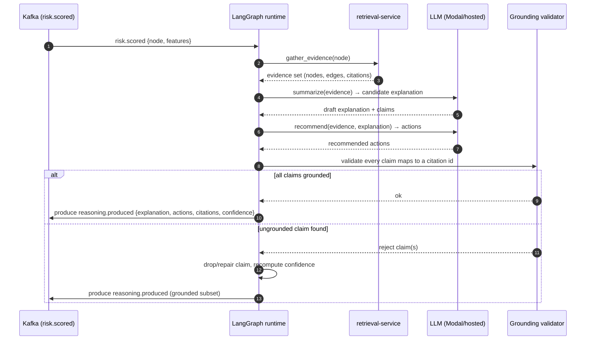

# Sequence diagrams

Four runtime flows: event ingestion into a graph update, the proactive notification path, a hybrid retrieval query, and the LLM reasoning/grounding step. All are Mermaid `sequenceDiagram`.

---

## 1. Event ingestion → graph update

A PR is merged in GitHub. Cortex turns that into typed entities, resolves them against existing nodes, discovers relationships, and writes the delta.

---

## 2. Proactive notification path

`graph.changes` triggers scoring; a threshold crossing triggers reasoning; the notification engine decides whether it is worth interrupting someone.

The two gates (score threshold, interrupt bar) are what keep this from being a spam firehose. The first bounds how often reasoning runs; the second bounds how often a human is interrupted. Both are per-org configurable — see [`docs/design/urgency-scoring.md`](../design/urgency-scoring.md) and the notification-service section of [`docs/architecture/services.md`](services.md).

---

## 3. Hybrid retrieval query

A user (or the LLM service) asks for context about an entity. Retrieval blends graph traversal, vector similarity, keyword, and filters, then fuses the rankings.

Graph traversal is the lead signal because relationships are the point; vector and keyword widen recall for things not yet linked. Fusion is reciprocal-rank fusion followed by a rerank that boosts candidates connected to the anchor by short, high-confidence paths. Design in [`docs/design/hybrid-retrieval.md`](../design/hybrid-retrieval.md).

---

## 4. LLM reasoning and grounding

Reasoning is a LangGraph state machine, not a single prompt. Every claim in the output must cite a graph node or edge; unsupported claims are dropped before the response leaves the service.

The validator is the anti-hallucination control: the model can only assert what the evidence set supports, and the confidence attached to the notification is derived from the confidence of the citations it rests on, not from the model's own certainty. See [ADR-0007](../adr/0007-grounded-llm-reasoning.md).
