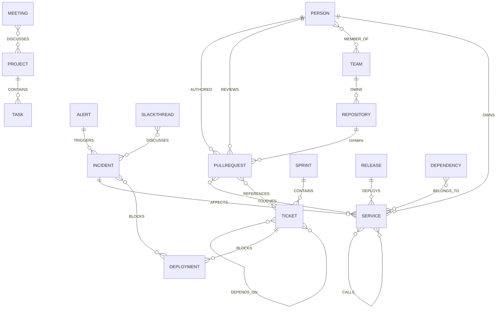

# Graph model (Neo4j)

The graph is the system of record for relationships. Nodes are entities extracted from source events; edges are relationships discovered between them. Every node and edge carries provenance (which event asserted it), confidence (how sure the discovery was), and temporal validity (`valid_from` / `valid_to`). This makes the graph auditable ("why does Cortex think X?"), correctable (retract an edge without a rebuild), and time-travelable ("what did the graph look like at deploy time?").

---

## Node labels

Every node has these base properties in addition to its type-specific ones:

| Property | Type | Meaning |
|---|---|---|
| `id` | string | Cortex-internal stable id (UUID) |
| `org_id` | string | Tenant. Every query is filtered by this. |
| `natural_key` | string | Source-native identity used for MERGE (e.g. `github:pr:checkout-api#482`) |
| `source` | string | Origin system, or `derived` |
| `created_at` / `updated_at` | datetime | First seen / last touched |
| `provenance` | list | Event ids that asserted or updated this node |

Node labels:

| Label | Represents | Key type-specific properties |
|---|---|---|
| `Person` | A human (unified across systems) | `display_name`, `emails[]`, `github_login`, `slack_id`, `jira_account` |
| `Team` | An org unit | `name`, `slug` |
| `Repository` | A code repo | `name`, `full_name`, `default_branch`, `importance` |
| `Service` | A deployable/runtime service | `name`, `criticality`, `tier` |
| `PullRequest` | A GitHub PR | `number`, `title`, `state`, `merged_at`, `additions`, `deletions` |
| `Issue` | A GitHub issue | `number`, `state`, `title` |
| `Commit` | A commit | `sha`, `message` |
| `Release` | A tagged release / deploy artifact | `tag`, `published_at` |
| `Deployment` | A deploy event/target | `env`, `scheduled_at`, `status` |
| `Ticket` | A Jira ticket | `key`, `status`, `priority`, `story_points`, `age_days` |
| `Sprint` | A Jira sprint | `name`, `start`, `end` |
| `Incident` | A PagerDuty incident | `number`, `severity`, `status`, `opened_at` |
| `Alert` | A PagerDuty alert | `dedup_key`, `status` |
| `SlackThread` | A Slack thread | `channel`, `ts`, `permalink` |
| `SlackMessage` | A message | `ts`, `text_ref`, `permalink` |
| `Channel` | A Slack channel | `name`, `is_private` |
| `NotionPage` | A Notion page/doc | `title`, `url` |
| `Project` | A project (Notion/Jira) | `name`, `status` |
| `Task` | A task | `title`, `status` |
| `Meeting` | A calendar event | `title`, `start`, `end` |
| `Dependency` | A library/package | `name`, `ecosystem`, `version` |
| `Technology` | A technology/framework | `name` |
| `Document` | Generic ingested doc chunk | `title`, `url`, `embedding_ref` |

`Person`, `Service`, and `Repository` are the entities most often unified across sources, so their resolution rules are the most important (below).

---

## Relationship types

Edges carry base properties too: `confidence` (0–1), `valid_from`, `valid_to` (null = current), `provenance` (asserting event ids), and `discovered_by` (`rule` | `embedding` | `llm`).

| Edge | From → To | Discovery signal |
|---|---|---|
| `OWNS` | Person/Team → Service/Repository | CODEOWNERS, repo admin, Jira component lead |
| `MEMBER_OF` | Person → Team | Org directory, repo team membership |
| `AUTHORED` | Person → PullRequest/Commit | GitHub author field (deterministic) |
| `REVIEWS` | Person → PullRequest | GitHub review events (deterministic) |
| `TOUCHES` | PullRequest/Commit → Service/Dependency | Changed paths → service map; import diffs |
| `REFERENCES` | PullRequest/Commit/SlackMessage → Ticket/Incident | Key/number mention in text (rule), then LLM |
| `DEPENDS_ON` | PullRequest/Ticket/Service → Ticket/Service/Dependency | Jira links, dependency manifests, LLM |
| `BLOCKS` | Ticket/Incident → Ticket/Deployment | Jira "is blocked by", incident-on-service |
| `DISCUSSES` | SlackThread/Meeting → Incident/Project/Ticket | Entity mentions + embedding similarity |
| `AFFECTS` | Incident → Service | PagerDuty service field, alert routing |
| `TRIGGERS` | Alert → Incident | PagerDuty dedup grouping (deterministic) |
| `CONTAINS` | Project → Task; Sprint → Ticket | Parent/child links (deterministic) |
| `DEPLOYS` | Release/Deployment → Service | Deploy metadata |
| `CALLS` | Service → Service | Service catalog, trace-derived topology |
| `BELONGS_TO` | Dependency/Database → Service | Manifest, config |
| `MENTIONS` | SlackMessage/NotionPage → Person/Service | @-mentions, entity linking |
| `ALIAS_OF` | any → any (same label) | Entity resolution merge decision |

`ALIAS_OF` is how identity unification is recorded without destructive merges: rather than deleting a duplicate, Cortex links it and treats the canonical node as the query target. This is reversible if the resolver was wrong.

---

## ER-style schema diagram



The motivating alert traverses a path across this schema: `PullRequest -TOUCHES-> Service <-AFFECTS- Incident -BLOCKS-> Deployment`, joined with `SlackThread -DISCUSSES-> Incident` and `Person -OWNS-> Service`. No single source has that path; the graph assembles it from six.

---

## Constraints and indexes (Cypher)

```cypher
// Identity + tenancy: natural_key unique per org, enforced per label
CREATE CONSTRAINT person_key   IF NOT EXISTS FOR (n:Person)      REQUIRE (n.org_id, n.natural_key) IS UNIQUE;
CREATE CONSTRAINT service_key  IF NOT EXISTS FOR (n:Service)     REQUIRE (n.org_id, n.natural_key) IS UNIQUE;
CREATE CONSTRAINT pr_key       IF NOT EXISTS FOR (n:PullRequest) REQUIRE (n.org_id, n.natural_key) IS UNIQUE;
CREATE CONSTRAINT ticket_key   IF NOT EXISTS FOR (n:Ticket)      REQUIRE (n.org_id, n.natural_key) IS UNIQUE;
CREATE CONSTRAINT incident_key IF NOT EXISTS FOR (n:Incident)    REQUIRE (n.org_id, n.natural_key) IS UNIQUE;
// ... one per label

// Lookup + tenancy filter performance
CREATE INDEX node_org         IF NOT EXISTS FOR (n:Person)   ON (n.org_id);
CREATE INDEX ticket_status    IF NOT EXISTS FOR (n:Ticket)   ON (n.org_id, n.status);
CREATE INDEX incident_open    IF NOT EXISTS FOR (n:Incident) ON (n.org_id, n.status, n.severity);

// Fulltext for keyword arm of hybrid retrieval
CREATE FULLTEXT INDEX entity_text IF NOT EXISTS
  FOR (n:PullRequest|Ticket|Incident|NotionPage|SlackMessage)
  ON EACH [n.title, n.text_ref];
```

Every constraint is scoped by `org_id` so identity collisions across tenants are impossible and there is no query path that omits the tenant filter.

---

## Incremental updates, no full rebuilds

Writes are idempotent `MERGE` on `(org_id, natural_key)`, so replayed or re-synced events converge onto the same node instead of duplicating. A graph write does three things:

1. **Resolve** — MERGE the entity by natural key; if the resolver finds a fuzzy identity match (same person, different source), attach `ALIAS_OF` to the canonical node rather than merging destructively.
2. **Update edges** — MERGE new edges; if an edge that previously existed is no longer asserted (e.g., a Jira "blocked by" link was removed), close it by setting `valid_to = now()` rather than deleting it.
3. **Emit** — publish `graph.changes` with the set of touched node ids, which is all the ranking tier needs to rescore the affected neighborhood.

Because edges are closed rather than deleted, the graph keeps history. A temporal query (`valid_from <= t AND (valid_to IS NULL OR valid_to > t)`) reconstructs the graph at any past time — the basis for the "what changed?" timeline and for explaining a past incident with the graph as it was, not as it is now.

---

## Provenance and confidence

Every assertion is traceable to the event(s) that produced it and carries a confidence. Deterministic discoveries (a GitHub author field) get confidence 1.0; embedding-similarity links get the similarity score; LLM-discovered links get the model's calibrated confidence, capped below 1.0 so a machine inference never outranks a hard fact. Notification confidence is the product/min of the confidences along the evidence path, so an explanation resting on one shaky LLM-inferred edge is surfaced as lower-confidence than one resting entirely on deterministic edges. This is what lets the reasoning layer cite evidence and attach an honest confidence instead of a flat "the model is sure."
