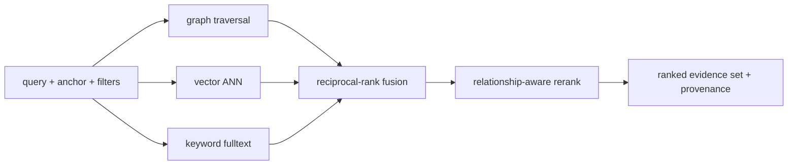

# Hybrid retrieval

Retrieval assembles the evidence set the reasoning layer and the dashboard search run on. It is graph-first: the lead signal is traversal from an anchor node, because the relationships are the answer. Vector similarity, keyword match, and metadata/time filters widen recall for things not yet linked or not linkable by rule. The four signals are fused into one ranked set with provenance attached to every item.

This replaces classic RAG. RAG retrieves text chunks by embedding similarity to a question. Cortex retrieves a connected subgraph plus corroborating documents, so the model reasons over structure (X blocks Y owned by Z) rather than over adjacent prose.

---

## The four arms

**Graph traversal.** Given an anchor node (the entity in question) and a query, do a typed, time-filtered k-hop expansion. Edge types are weighted — `BLOCKS`, `AFFECTS`, `DEPENDS_ON` expand further than `MENTIONS` — and only currently-valid edges (`valid_to IS NULL`) are followed unless a historical timestamp is supplied. This yields candidate nodes with the path that reached them.

**Vector similarity.** Embed the query and run ANN search in Qdrant over node/subgraph/document embeddings, filtered by `org_id`. This surfaces semantically related entities that have no edge yet — the seed for later relationship discovery, and recall insurance when the rule tier missed a link.

**Keyword.** Neo4j fulltext index over titles and text refs. Catches exact identifiers (a ticket key, a service name, an error string) that embeddings blur.

**Filters.** Metadata and time predicates applied to all arms: `org_id` (always), label, status, severity, owner, time window. Filtering happens inside each store's query, not after fusion, so the arms return already-scoped candidates.

---

## Fusion and rerank

The arms produce four ranked candidate lists. They are combined with reciprocal-rank fusion, which needs no score calibration across heterogeneous arms:

```
RRF(node) = Σ_arm  weight_arm / (K + rank_arm(node))     # K ~ 60
```

Then a relationship-aware rerank adjusts the fused order: candidates connected to the anchor by short, high-confidence paths are boosted; candidates reachable only through long or low-confidence paths are damped. The rerank uses the same edge-confidence values the urgency scorer uses, so retrieval and scoring agree on what "closely related" means.



Arm weights default to graph 0.45, vector 0.35, keyword 0.20 and are per-org tunable. For a purely lexical query (someone pastes a ticket key) keyword naturally wins on rank; for a vague query ("what's risky in payments") graph and vector dominate.

---

## Embeddings

`retrieval-service` owns the embedding lifecycle. On `graph.changes` it (re)embeds the affected nodes and their local subgraph and upserts to Qdrant keyed by node id, with `org_id` in the payload for filtering. Three embedding scopes are stored so different queries hit the right granularity:

- **Node** — name/title + key properties. For entity lookup.
- **Subgraph** — a serialized k-hop neighborhood. For "give me the context around X."
- **Document** — chunked Notion pages, Slack threads, PR descriptions. For content search.

Embedding generation calls any OpenAI-compatible `/v1/embeddings` endpoint (`CORTEX_EMBEDDING_PROVIDER=openai`), with a dependency-free hashing embedder as the offline default so the arm runs with no key. An in-memory index backs the default runtime and Qdrant backs production. Vectors are versioned by model id so a model upgrade re-embeds lazily rather than invalidating everything at once.

---

## Caching

Result sets can be cached (keyed by a hash of `(org_id, query, anchor, filters, arm_weights)`) with a short TTL, since the underlying graph changes; the Redis-backed cache is a scaling target. Embeddings are cached in-process by content hash (identical text embeds once). LLM-facing retrieval and dashboard search share the cache, so a question the reasoning layer already asked is free when a user asks it too.

---

## Why this beats RAG here

A RAG system asked "will the checkout deploy fail" retrieves chunks containing "checkout" and "deploy" and hopes the incident and the blocking ticket happen to be in adjacent text. They are not — they live in PagerDuty and Jira, in different systems, authored by different people, with no shared prose. Cortex's graph arm walks `Deployment <-BLOCKS- Ticket <-... Incident -AFFECTS-> Service`, returns that path as evidence, and the reasoning layer explains it with citations. The vector and keyword arms are there so nothing is missed when the graph is incomplete, not as the primary mechanism.
